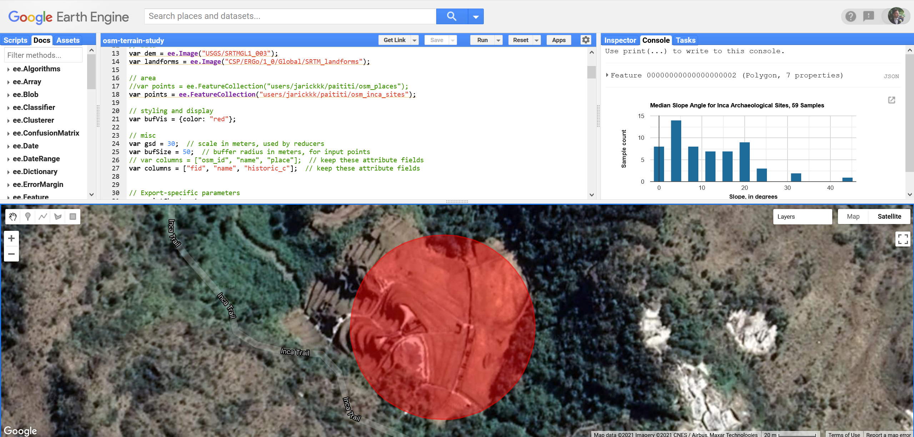

<h1 align="center">Data Processing Scripts for Earth Engine</h1>

> Code and data used in the geospatial analysis by the [Patiti Research](https://paititi.info/) team. It is developed to be run inside the [Google Earth Engine](https://earthengine.google.com/) platform. You need to have both Google (Gmail) and Google Earth Engine accounts in order to use it.

The code, coupled with the provided data, allows studying the distribution of morphometric characteristics of terrain for specified point samples by making a chart and exporting the derived terrain products as GeoTiffs.

In theory, it can bring insights on where to look for ancient settlements of Inca and other Andean cultures. See [a paper](https://www.sciencedirect.com/science/article/pii/S1040618215010666) of D. Visentin et al. (2016), who demonstrated **a correspondence between some modern paths and (pre-)historic tracks because mountain environments tend to constrain movements**. [Another paper](https://www.sciencedirect.com/science/article/pii/S1040618217314787) by S. Caracausi et al. (2018) suggests that at high altitudes, due to the same reason, **paths and locations suitable for temporary camps did not change significantly during the centuries.**

## Content

### osm-terrain-study.js

A JavaScript code that takes the provided point samples making a 50-m buffer around them, and calculates terrain morphometry. In the end, it summarizes the statistics as a bar chart and allows exporting the resultant terrain raster.

### data/osm_places.zip

An extract of small settlements from OpenStreetMap, covering a vastAndean area of the Cusco Region and its surroundings in Peru. Pointswere selected by the condition `place IN ('hamlet', 'isolated_dwelling','farm', 'allotments')` on Feb 10, 2021.

### data/osm_inca_sites.zip

Locations of various inca-related archaeological sites, extracted from OpenStreetMap using the *overpass turbo* with the following query:

    [out:json][timeout:25];
    (node["historic:civilization"~"inca",i];
    way["historic:civilization"~"inca",i];
    relation["historic:civilization"~"inca",i];);
    out body; >; out skel qt;

After OSM polygons had been extracted, they were converted to centroids and manually verified.

## Contact

  - Organization: [Paititi Research](https://paititi.info/)
  - Developer: [Yaroslav Vasyunin](https://www.linkedin.com/in/vasyunin)
  - Project Link: [github.com/y-vasyunin/ee-paititi-research](https://github.com/y-vasyunin/ee-paititi-research)

## License

Except data sets, this project is licensed under the GPL 3.0. See the [LICENSE](LICENSE) file for details.

Data © [OpenStreetMap](https://www.openstreetmap.org/) contributors, [ODbL](https://opendatacommons.org/licenses/odbl/1-0/), [Terms](https://www.openstreetmap.org/copyright); Data acquisition by [overpass turbo](https://overpass-turbo.eu/).
